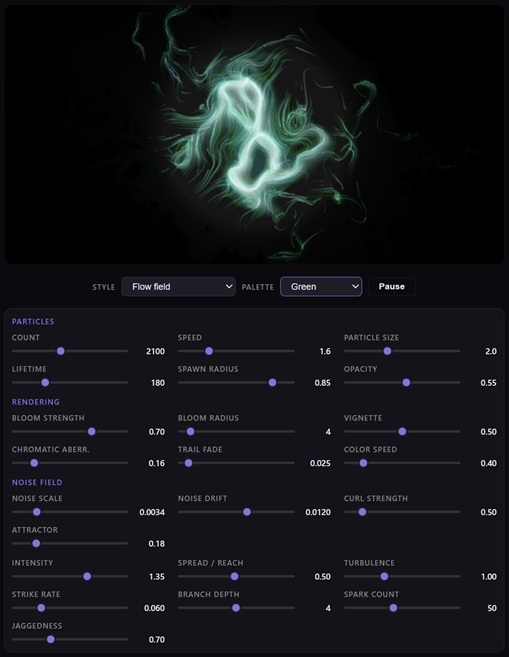

A lightweight, single-HTML JavaScript editor designed for generating particle noise with customizable parameters and colors in a single file for easy experimentation. Just download the files and open NoiseEditor.html using any web browser.  

